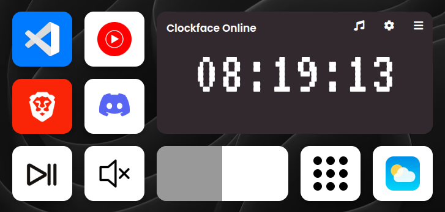

# Stream Deck

### A modern, open-source, cross-platform, and 100% customizable and extensible Stream Deck app
### Transform you old phone into a Stream Deck for free, just a webbrowser needed




## Features
- **Cross-platform**: but only tested on Linux for now
- **Customizable**: Everything is customizable, since it based on plugin system, and the UI is built on top of web technologies, so you can make it look however you want.
- **Extensible**: A very rich plugin system, where the only limit is your imagination. You can create your own plugins, or use the ones that are already available.
- **Open-source**: Fully open-source and free to use.

## Installation
clone this repository locally
```bash
git clone https://github.com/AZachia/streamdeck.git && cd streamdeck
```

install the dependencies
```bash
pip install -r requirements.txt
```

To customize the app, you must edit the `config.json` file.
Once the config is set up as you want, you can run the app with the following command:

```bash
python main.py
```

and then open the URL in every device you want to use as a stream deck (it is the second ip in displayed in the terminal, it's your local ip address, and the port is 5000)

## Roadmap
 ✅ - implemented | 🛠 - in progess | 📌 - todo

 - ✅ Plugin system
 - ✅ `core`, `volume` and `webopener` plugins
    - Core components, such as key, background, and scale
    - Volume and media control
    - Website opener
 - 🛠 Windows port
 - 🛠 Improve plugin sysyem
 - 📌 Visual interface to edit the config
 - 📌 better way to instal and manage plugins


## Contributing
Contributions are welcome!